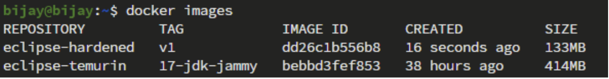
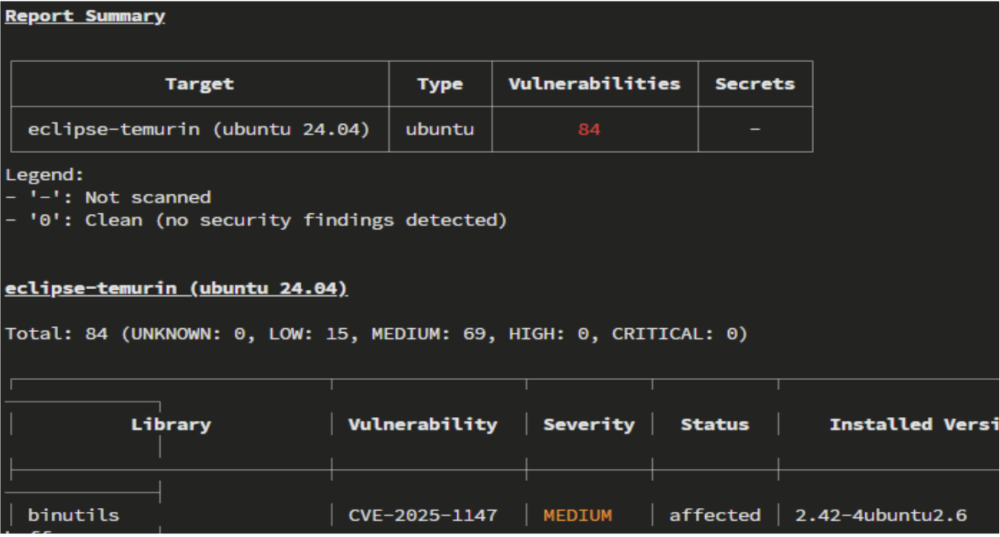
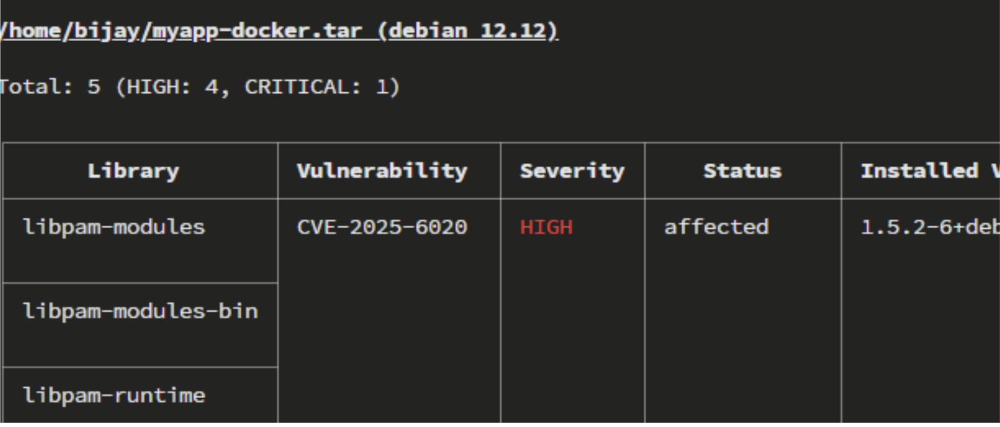

# Base Image Hardening Guide

## Purpose

This document outlines the essential practices for hardening container base images to ensure security, integrity, and compliance across build and runtime environments.

## 1. Theoretical Goals

| Goal | Security Principle | Description |
|------|-------------------|-------------|
| **Reduce attack surface** | Least functionality | Remove unnecessary tools, shells, and compilers |
| **Ensure provenance** | Trust chain integrity | Use verified, signed sources |
| **Minimize vulnerabilities** | Proactive assurance | Scan and patch for CVEs regularly |
| **Control privileges** | Least privilege | Run containers as non-root users |
| **Enforce immutability** | Tamper resistance | Prevent unauthorized image drift |
| **Document and audit** | Transparency & accountability | Maintain SBOMs and audit logs |

These principles are derived from **classical information security theory** and applied to the **container ecosystem**.

## 2. Layered Hardening Model

| Layer | Principle | Theoretical Basis |
|-------|-----------|-------------------|
| 1. Trusted Foundation | Root of Trust | Cryptographic trust chain |
| 2. Source Verification | Authenticity & Provenance | Trust boundary theory |
| 3. Minimization | Least Functionality | Complexity reduction |
| 4. Scanning & Validation | Proactive Assurance | Control & fault prediction |
| 5. Privilege Control | Least Privilege | Access control theory |
| 6. Runtime Controls | Defense in Depth | Layered resilience |
| 7. Governance & Compliance | Accountability | Governance frameworks |

## 3. Practical Implementation Steps

### 1. Trusted Foundation

- Use **official and verified base images** (e.g., Docker Hub, vendor repositories)
- Treat the base image as the **immutable source of truth**

### 2. Source Verification

- Pull images by **digest (SHA256)**, not tags
- **Verify signatures** using tools like **Cosign** or **Notary**
- Mirror base images to **internal trusted registries**

### 3. Component Minimization

- Remove **unnecessary packages**, compilers, and shells
- Use **runtime-only** or **distroless** images
- Employ **multi-stage builds** to separate build and runtime environments

### 4. Scan and Patch

- Continuously scan using tools like **Trivy**, **Grype**, or **Clair**
- Regularly rebuild and patch images
- Generate and attach a **Software Bill of Materials (SBOM)** for traceability

### 5. Privilege and User Control

- Run containers as **non-root** users
- Drop **unneeded Linux capabilities**
- Use **read-only file systems** when possible

### 6. Runtime Security Controls

- Apply **AppArmor**, **SELinux**, and **Seccomp** profiles
- Use the **no-new-privileges** flag
- Restrict **network** and **filesystem** access
- Implement **health checks** and **signal handling** properly

### 7. Governance and Compliance

- Define and enforce **security-as-code policies** (e.g., **OPA**, **Kyverno**)
- Follow **CIS** and **NIST** container benchmarks
- Promote images between environments using the **same digest** (no rebuilds)
- Maintain **audits** and enable **continuous compliance monitoring**

## 4. Reference Tools and Resources

- **Distroless Images:** [GoogleContainerTools/distroless](https://github.com/GoogleContainerTools/distroless)
- **Image Scanning:** [Trivy](https://github.com/aquasecurity/trivy)
- **Enterprise Hardened Images:** [Docker Hardened Images](https://www.docker.com/products/hardened-images/)

### Usage Note

When hardening an image like `eclipse-temurin:17-jdk-focal`:

1. Verify its **source and digest**
2. Rebuild a **minimal** variant
3. Integrate **scanning**, **privilege**, and **runtime** policies
4. Govern the process via **automated compliance pipelines**

---

# Example: Hardening eclipse-temurin:17-jdk-focal

This walkthrough demonstrates how to transform a standard `eclipse-temurin:17-jdk-focal` image into a hardened, production-ready container.

## 1. Verify the Source and Digest

**Goal:** Ensure provenance and authenticity.

```bash
# Check and pull image by digest (not floating tag)
docker pull eclipse-temurin@sha256:<verified-digest>

# Verify source and signature (using cosign)
cosign verify docker.io/library/eclipse-temurin:17-jdk-focal
```

✅ **Achieved:**
- Image origin verified
- Prevents using tampered or unofficial images

### Concept of Digest

A digest is a cryptographic SHA256 hash that uniquely identifies a specific image layer and manifest. Unlike tags (like `17-jdk-focal`) which can be reassigned, a digest always points to the exact same image content.

**Benefits:**
- Guarantees you are running the exact version of the image you expect
- Protects against accidental or malicious updates to floating tags
- Essential for security-focused deployments and reproducible builds

Example:
```bash
docker pull eclipse-temurin@sha256:2f6e1f0a7a1a9e3c1a5d4b6f4e7d8c9a...
```

This ensures the pulled image is exactly the verified one, every time.

## 2. Create a Minimal and Secure Dockerfile

We remove unnecessary packages, use non-root users, apply least privilege, and ensure immutability.

```dockerfile
# Stage 1: Build stage (compile application)
FROM eclipse-temurin:17-jdk-focal AS builder
WORKDIR /app
COPY . .
RUN ./gradlew build --no-daemon

# Stage 2: Runtime stage (minimal and secure)
FROM gcr.io/distroless/java17:nonroot
WORKDIR /app
COPY --from=builder /app/build/libs/myapp.jar /app/myapp.jar

# Run as non-root (built into distroless)
ENTRYPOINT ["java", "-jar", "/app/myapp.jar"]
```

Build:
```bash
docker build -f Dockerfile -t eclipse-temurin-hardened .
```


✅ **Achieved:**
- Reduced image size from ~414 MB to ~133 MB
- Removed compilers, shells, and package managers
- Enforced non-root runtime
- Greatly reduced attack surface

## 3. Scan the Hardened Image

**Goal:** Detect vulnerabilities early.

```bash
trivy image eclipse-temurin-hardened:17
```

**Vulnerabilities before hardening:** 84  

**Vulnerabilities after hardening:** 5


✅ **Achieved:**
- Found and fixed known CVEs
- Attached a generated SBOM (`trivy sbom ...`) for compliance

## 4. Apply Runtime Security Controls

**Goal:** Prevent privilege escalation and enforce policy boundaries.

In your Kubernetes deployment manifest or Docker run command:

```yaml
securityContext:
  runAsNonRoot: true
  readOnlyRootFilesystem: true
  allowPrivilegeEscalation: false
  capabilities:
    drop: ["ALL"]
```

✅ **Achieved:**
- Read-only filesystem
- No root privileges
- Hardened runtime enforcement (Defense in Depth)

## 5. Governance and Compliance

Integrate with policy enforcement tools (e.g., **Kyverno**, **OPA**) to automatically validate the hardened image before deployment.

Example Kyverno policy:

```yaml
apiVersion: kyverno.io/v1
kind: ClusterPolicy
metadata:
  name: enforce-nonroot
spec:
  validationFailureAction: enforce
  rules:
  - name: check-nonroot
    match:
      resources:
        kinds: ["Pod"]
    validate:
      message: "Containers must run as non-root"
      pattern:
        spec:
          containers:
          - securityContext:
              runAsNonRoot: true
```

✅ **Achieved:**
- Consistent compliance enforcement
- Prevents deployment of unverified or unsafe images

## 6. Mirror Hardened Image to Local Registry (Harbor)

**Goal:** Store and distribute trusted hardened images internally.

### Steps

```bash
# Tag the hardened image for Harbor
docker tag eclipse-temurin-hardened:17 harbor.<yourdomain>.com/secure/eclipse-temurin-hardened:17

# Log in to Harbor
docker login harbor.<yourdomain>.com

# Push the hardened image
docker push harbor.<yourdomain>.com/secure/eclipse-temurin-hardened:17
```

✅ **Achieved:**
- Image now hosted in a **trusted internal registry**
- Enables version control, scanning, and access management through Harbor
- Prevents use of unverified external sources in CI/CD pipelines

## 7. Result: Comparison Summary

| Aspect | Original Image (eclipse-temurin:17-jdk-focal) | Hardened Image (eclipse-temurin-hardened:17) |
|--------|-----------------------------------------------|----------------------------------------------|
| **Size** | ~414 MB | ~133 MB |
| **No of Vulnerabilities** | 84 | 5 |
| **User** | root | non-root |
| **Attack Surface** | High (many utilities) | Minimal (runtime-only) |
| **Vulnerability Exposure** | Frequent CVEs | Reduced via minimal base |
| **Mutability** | Writable filesystem | Read-only filesystem |
| **Source Trust** | External registry | Verified and mirrored to Harbor |
| **Compliance** | None | Policy-enforced (Kyverno/OPA) |

## Outcome

By following these steps, the hardened image achieves:

- **Reduced attack surface** (fewer binaries and dependencies)
- **Improved provenance** (trusted digest and internal mirroring)
- **Runtime safety** (non-root, read-only filesystem)
- **Continuous compliance** (policy-driven governance)
- **Operational efficiency** (smaller, faster, reproducible builds)

---

## Contributing

Feel free to submit issues and enhancement requests!

## License

This guide is provided as-is for educational and operational purposes.
